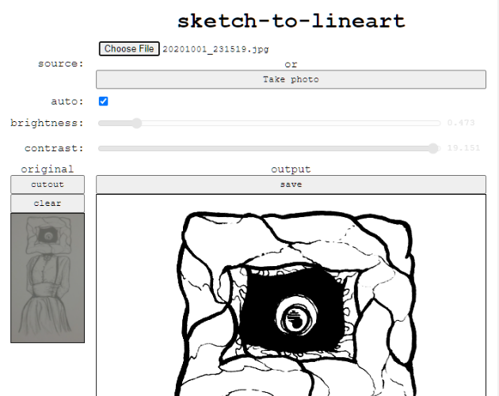

# sketch-to-lineart

tool for converting sketches to transparent lineart

- [itch.io](https://seansleblanc.itch.io/sketch-to-lineart)
- [github.io](https://seleb.github.io/sketch-to-lineart/)

## How to use

1. Import an image, or take a photo
2. Use "cutout" to draw a region on the original image you want to use
3. Uncheck "auto" and adjust "brightness"/"contrast" as needed
4. Right-click the output preview (or use the "save" button) to save

